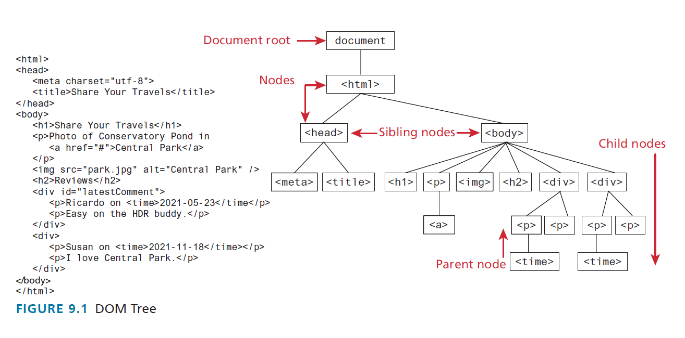

# Lecture 06

**2021-09-28(T)**

Recording available here: https://youtu.be/icaBTeWSvIY

**!!! Start Recording, JP !!!**

---

## Odds & Ends In JP's Head

- did you look at the estimated topic coverage timeline?
  - kind of a flipped classroom situation: best if you read/researched ahead and then use the lectures as a review / source of extra tidbits
- have you been thinking 'bout the other views in the assignment?
- when working in groups with Git, I'd suggest working on different files to avoid merge conflicts

---

## Something On Your Mind?

https://onlinequestions.org (use event number **20210406**) or Meet chat

**Any questions right now?**

---

## Code Sharing

This is new. I like it better. (Used last year...no copy/paste issues and not editable.)

URL for this session: https://floobits.com/jpratt-mru/lec-06

_comment after the fact: I think I should maybe put stuff in here ahead of time? But I kinda want to avoid folks just copying and pasting ahead...but...why do I want to avoid that?!?_

---

## What Should Be On My Radar?

- Thursday's class
  - recorded aync lecture avail (Wed? Thu? I'll announce. I'll split 'em up, too.)
  - [events hosted by MRU](https://www.mtroyal.ca/IndigenousMountRoyal/events/journeytoindigenization.htm)
- tut-03
- asg-1 milestone 2
  - should be started
  - see if you can get some content on that page after today's lecture

---

## What's Today About?

Today's the start of the fun stuff (I'm not being sarcastic): you get to actually _use_ JS to _do cool things_ to a web page.

We'll be talking about how to manipulate the DOM Tree you learned about in Web 1: that means grabbing stuff from it, altering what's there, and adding things to it.

---

## Useful To Recall

- Functions: we'll be calling a lot of methods on some pre-existing objects like **document** and **HTMLElement**. We'll also be passing functions as arguments into other functions, which will feel weird at first.
- Loops: we'll be iterating over some odd almost-array things, **NodeList** and **HTMLCollection**.
- Arrow Syntax: we'll be using it a bit when we talk about event handlers and how to write code that runs only after the DOM Tree is fully loaded.

## 9.1 The Document Object Model

Remember the **DOM Tree** from Web 1?

## 

We were able to make our web pages _look_ certain ways by using CSS to target the nodes in the tree.

Well, we can programatically (i.e. with code) do a whole bunch of groovy stuff with the tree - and therefore any web page - via the **Document Object Model (DOM)**. The DOM is a programming interface for your web pages: it defines a representation of that page's DOM Tree and specifies a collection of methods that can be used with that tree. You will become nauseatingly familiar with a few of the more common methods in this collection over the remainder of the course.

Using the DOM methods, you can not just style things - though we _can_ do that - you can also add, remove, and modify anything on the page via these methods.

It's quite cool, but this is all sounding pretty abstract. Let's change that.

---

## 9.1.1 Nodes and NodeList

See those boxes in our DOM Tree diagram? Those are `nodes`. While they're just an abstract term when talking about the Tree, they're real-life objects that have properties - including methods! - in the DOM.

Let's hold off on this for a second. It'll be **much** easier to discuss these important concepts if we actually have live ones in front of us!

To get these suckers, we will need to go through a special object: the `document` object.

---

## 9.1.2 Document Object

Let's take a look at this fancy `document` object. Everything we do going forward will be using this sucker - it's super-important!

Pop open an incognito window (we wanna avoid the noise of any browser extensions) and head to the console.

Let's type some stuffs and see what happens after we hit Enter each time.

```javascript
document; // so the Console seems to know about this thing; it's globally available

typeof document; // not surprising

// type document again, hit the period...oh wow

// How many properties does this document object have?!?!
// Let's find out.

// note that this is NOT a for-of loop - it's a for-in loop!
for (const property in document) {
  console.dir(property);
}

// zoinks! That's a lotta properties!

// Humour me: ctrl + F to find something in the output. Search for 'write'.
```

### 🛑 <span style="color:red">STOP, LOOK, and THINK</span>

- [ ] `document` is an object representing a web page; it's got a TON of properties - many of them methods - attached to it

You will be using `document` **all the time**. While you could spend hours just exploring all the different properties it has (and I urge you to do some exploring), we'll wind up using a handful of methods at this level.

These methods can be be grouped into 3 broad categories:

1. **selection methods**: we use these to grab onto parts of the web page
2. **manipulation methods**: we use these to change things grab onto
3. **event methods**: we use these to cause stuff to happen when users interact with the web page

We'll start with the selection methods.

---

## 9.1.3 Selection Methods

Let' start off with (arguably) the method that you'll likely wind up using a lot.

Let's get a bit meta and use the BCIS page (https://www.mtroyal.ca/ProgramsCourses/FacultiesSchoolsCentres/ScienceTechnology/Departments/MathematicsComputing/Majors/Computer-Information-Systems/index.htm) to play.

### getElementById(id)

```javascript
// there's an alert up at the top...pop open the Elements tab and find it
// ...
// ... got it? Let's grab it.
document.getElementById("alert-row");

// notice the drop-down arrow?
// there's a lot of nested stuff there...hmmm....

// we can store the return value of this method into a variable or constant

const alertRow = document.getElementById("alert-row");

// if you now type alertRow and then a period, you see a LOT of stuff there
// whar are they?

// there's a popup on the page we can grab, too
// try grabbing it and putting it in a variable/constant called popup
let popup = document.getElementById("program-page-popup");

// what if you try and get something not there?
document.getElementById("greatgooglymoogly");
```

### 🛑 <span style="color:red">STOP, LOOK, and THINK</span>

- [ ] You can grab any HTML tag (well, the representation of that tag in the DOM) that has an id using `document.getElementById(id)`.
- [ ] This method returns an [Element](https://developer.mozilla.org/en-US/docs/Web/API/Element) object or a null.
- [ ] Elements have a lot of useful properties which will play with in a bit.
- [ ] Elements inherit a bunch of other useful properties from [Node](https://developer.mozilla.org/en-US/docs/Web/API/Node), which is an abstract class (remember Java?). You can't make a Node - it's abstract.

### getElementsByClassName(className)

```javascript
// sometimes you want to grab everything that has a certain class atribute
document.getElementsByClassName("row");

// if you inspect what comes back, it seems to be something called an HTMLCollection
// and it seems to have 14 things in it
//
// what does this HTMLCollection seem to be?

//
// if we pop the dropdown, as you mouse over the entries, you might see that
// the part of the page corresponding to that entry is highlighted on the page
//
// also - need dev tool trick incoming - you can right-click on these things and
// reveal it in the elements panel. If you want to see that thing on the page, you
// can right-click on the element and choose "Scroll into view"

// let's store this return value as well
const allRows = document.getElementsByClassName("row");

// if we hit the . (you should be getting into the habit of doing this btw)
// we se a reasonably short list of properties

allRows.length; // not surprising
allRows[0]; // an Element
allRows[-1]; // out of bounds

// compare to
allRows.item(0);
allRows.item(-1);

// can we for-of through this thing?!?
for (const row of allRows) {
  console.log(row);
}

// what if no such class exists?
document.getElementsByClassName("yar-Im-a-pirate"); // not a null!
```

### 🛑 <span style="color:red">STOP, LOOK, and THINK</span>

- [ ] You can grab _all_ DOM elements that have a given class with `document.getElementsByClassName("blah")`.
- [ ] You get back an array-like collection called an HTMLCollection - but it's NOT an array.
- [ ] You can access elements from this collection using `[index]` notation or the `item(index)` method. What's the difference in behaviour again?
- [ ] Even though it's not an array, you can still iterate through it.

### getElementsByTagName(tagName)

```javascript
// sometimes, you just want all the divs, or imgs, or spans, or....

document.getElementsByTagName("img"); // yup, another HTMLCollection

// btw, these HTMLCollections are "live":
const spans = document.getElementsByTagName("span");
const postal = spans[22];

// now go into the Elements panel and change the postal code to something...
postal; // see? it's changed!
```

### 🛑 <span style="color:red">STOP, LOOK, and THINK</span>

- [ ] You can grab _all_ DOM elements of a given HTML tag type with `document.getElementsByTagName("blah")`.
- [ ] HTMLCollections are "live" - if you latch onto something in the collection and something changes on the page, the thing you latched onto might change as well. Careful!
- [ ] There's also a `getElementsByTagNameNS` method...don't worry about it - it deals with something called namespaces which we're not concerned with.

### querySelector(cssSelector)

```javascript
// you'll be happy to know your mad CSS selector skills will not go to waste

// let's grab the first div on the page
document.querySelector("div"); // what kind of thing are we getting back?

// or the first image element that is the immediate child of a div
document.querySelector("div > img");

// of the first thing that has the class row
document.querySelector(".row");

// or how about that div with an id of alert-row?
document.querySelector("#alert-row"); // is your WAAAAAAIT A MINUTE gland working?

// what if the thing just ain't there? null again?
document.querySelector("mst3k");
```

### 🛑 <span style="color:red">STOP, LOOK, and THINK</span>

- [ ] You can grab _the first_ DOM element matching a given CSS selector with `document.querySelector(cssSelector)`. You get an Element or null back.
- [ ] This is a STUPIDLY USEFUL METHOD. And it will give your CSS selector skills a workout. Win-win!
- [ ] Yes, you CAN use this instead of `getElementById`. Your choice - there are arguments to be had for both sides.

### querySelectorAll(cssSelector)

```javascript
// probably not hard to guess what this does!

// let's try our previous selectors out again
document.querySelectorAll("div"); // what kind of thing are we getting back?
// and WAAAAAIT A MINUTE!....

// A NodeList is NOT an HTMLCollection! Nor is it an array! Madness!

// you might be wondering "where's my dropdown?!?" Just too many things came back.
// Try this next one to prove that I'm not fibbin'

// ALL the image elements that is the immediate child of a div
document.querySelectorAll("div > img");

// ALL the things that have the class row
document.querySelectorAll(".row"); // WAAAAAIT A MINUTE!...

// Now what would THIS do?
document.querySelectorAll("#alert-row");

// can we iterate through these NodeList thingies?
const allDaDivs = document.querySelectorAll("div");
for (const div of allDaDivs) {
  console.log(div);
} // ayup

// can we access things from the NodeList like an array?
allDaDivs[3];

// it has item() as well, like HTMLCollection
allDaDivs.item(3);
```

### 🛑 <span style="color:red">STOP, LOOK, and THINK</span>

- [ ] You can grab _all_ DOM element matching a given CSS selector with `document.querySelectorAll(cssSelector)`. You get a NodeList back.
- [ ] The NodeList thingie is not an array and not an HTMLCollection. But you can still iterate through it and grab things out of it, like an array.
- [ ] Yes, you CAN use this instead of both `getElementsByClassName` and `getElementsByTagName`!

---

## SIDETRACK: chaining these selection methods

There's a lot of nesting going on in the DOM, right? Like, a `<div>` might have a whole bunch of other things in it - lists and spans and other divs and tables and...

So we can do some stuff like this

```javascript
document.querySelectorAll(".row")[3].querySelector("span");

// here's a midterm-type question: why can't we do this?
document.querySelectorAll(".row").querySelector("span");

// we can do this

document.querySelector("#search").querySelector("#toggle-search-xs");

// but we can't do this!

document.querySelector("#search").getElementById("toggle-search-xs"); // gadzooks!
```

Chaining is pretty useful - when it's not too long - because it can help us avoid polluting the global namespace with properties.

---

## SIDETRACK: turning NodeLists and HTMLCollections into "real" arrays

You sometimes might want to turn HTMLCollection or NodeList results into "real" arrays to take advantage of some of the sweet array methods available (or just to have consisitency in your code).

You can do this a number of different ways.  
Here are 2 very common ones:

```javascript
const imagesAsHTMLCollection = document.getElementsByTagName("img");
const imagesAsNodeList = document.querySelectorAll("img");

Array.from(imagesAsHTMLCollection);
Array.from(imagesAsNodeList);

// or

[...imagesAsHTMLCollection];
[...imagesAsNodeList];
```

---

## 9.1.4 Element Node Object

As mentioned, we get back **Element** objects (the text calls them Element Node objects, which is also true, since Element is a JS-style subclass of Node).

These objects are chock-full of useful properties. We'll be some of these properties quite often, especially when we get around shortly to changing the DOM.

Let's play a bit.

We'll use the default Incognito window, 'cause it's nice an uncluttered.

```javascript
// let's grab the div holding the first unordered list in here. How?
let firstListWrapper = document.querySelector("#bulletpoints-wrapper>div"); // one way

// how can we see all the properties with devtools?
// notice those words (HTMLDivElement, HTMLElement, Element, Node,
// EventTarget, Object)? They basically showing us the JS inheritance
// chain of this thing! Neat.

// let's try out some of the Element properties available

firstListWrapper.tagName; // well, duh. Note it's in ALL CAPS

firstListWrapper.id; // empty string in this case - no id attribute on this div!

firstListWrapper.className; // classes on this thing with spaces between

firstListWrapper.classList; // another array-like thing holding class names

firstListWrapper.innerHTML; // this makes more sense if you View Page Source
// notice how even the whitespace - both spaces and newlines - are here!

firstListWrapper.style; // what the HECK is this?!?!
// clue number one: pop it open and look at the names there...familiar?
// clue number two: https://developer.mozilla.org/en-US/docs/Web/CSS/Reference#index
// we'll talk more about this property in 9.2.1

// and now some of the Node properties available

firstListWrapper.nodeName; // hmmm..seems the same as tagName

firstListWrapper.textContent; // interesting...what do you notice?

firstListWrapper.childNodes; // another NodeList...interesting contents

firstListWrapper.parentNode;

firstListWrapper.firstChild; // this almost begs to be made an exam question

firstListWrapper.lastChild;

firstListWrapper.nextSibling; // these next 2 aren't what you expect...

firstListWrapper.previousSibling;
```

### 🛑 <span style="color:red">STOP, LOOK, and THINK</span>

- [ ] The Element objects we select are chock-full of properties. Some come from the Element class itself, while others come from the parent Node class.
- [ ] A lot of the Node properties deal with the relationship of the given Element with other Nodes in the DOM...and some of these are [Text Nodes](https://developer.mozilla.org/en-US/docs/Web/API/Text)!
- [ ] Some properties (like tagName, classList, firstChild) are read only, but many aren't. MDN is your friend.
- [ ] You don't have to memorize these (again, yer friend MDN is there for you), but you'll wind up using some of them so often that you'll memorize those ones. That's perfectly fine.

---

## 9.2 Modifying the DOM

So we've seen that we can grab DOM Element objects out of a web page using DOM selector methods.

And we've also seen that the Element objects have lots of properties on them.

While some of these properties are read-only, a large number are not. This means that we can do a TON of neat things to a page with JS.

Let's get started.

---

# Technically, we didn't end here....but I guess we should have. I'll pick up the next async lecture from changing styles!

---

**HERE ENDETH THE LESSON**

---

## questions from y'all during the lecture

Not a lot of questions to post this time!

### anonymous qs

### Meet qs
